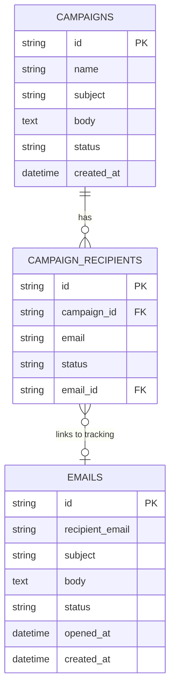

# MailFlow AI - Backend

The MailFlow AI backend is a Flask-based REST API that orchestrates AI-powered outreach, bulk email campaigns, and real-time tracking events.

## 🚀 Key Features

- **Gemini AI Integration**: Services for brand-specific research and lead generation.
- **Campaign Orchestration**: Full lifecycle management of bulk email sequences.
- **High-Performance SMTP**: Optimized delivery via intelligent connection reuse.
- **Open Tracking**: Automatic pixel injection and real-time event logging.
- **Hybrid Database**: Support for PostgreSQL (Production) and SQLite (Local).

## 🛰 Open Tracking System

The system implements a transparent, pixel-based tracking mechanism to monitor recipient engagement.

### Technical Implementation
- **Unique Pixel**: Each outgoing email is injected with a unique tracking pixel:
  `GET /track/open/<email_id>`
- **Event Processing**: When requested, the backend:
  - Marks the corresponding email record as `OPENED`.
  - Records the `opened_at` ISO timestamp.
  - Returns a `1x1` transparent GIF image (MIME: `image/gif`).

### Design Considerations
- **Idempotency**: Multiple requests for the same tracking pixel do not overwrite the initial `opened_at` timestamp or create duplicate events.
- **Performance**: The tracking endpoint is a lightweight operation with minimal overhead to ensure rapid response times for email clients.
- **Privacy-First**: No personal data beyond the internal `email_id` is transmitted during the tracking request.

### Limitations
- **Client Blocking**: Modern email clients or security plugins may block external images, preventing tracking.
- **Best-Effort**: Tracking is a best-effort metric and may not represent 100% of recipient activity.

## 📐 Design Principles

- **Simplicity Over Abstraction**: Prioritizing readable, maintainable code over complex architectural patterns.
- **Clear Separation**: Strict adherence to a layered architecture (**Routes → Services → Repository**).
- **Observability**: Detailed logging for critical lifecycle events including email registration, SMTP delivery, and tracking requests.
- **Correctness First**: Emphasis on data integrity and state persistence over a broad feature set.

## 📊 Database Schema

The system uses a relational schema designed for high-performance tracking and campaign management.



### Core Tables
| Table | Description |
|-------|-------------|
| **`campaigns`** | Stores bulk email definitions, templates, and execution status. |
| **`campaign_recipients`** | Individual leads and their delivery status. |
| **`emails`** | Unified log for all sent emails and tracking events. |

## 🛠 Tech Stack

- **Framework**: Flask (Python 3.10+)
- **ORM**: SQLAlchemy (Flask-SQLAlchemy)
- **Database**: PostgreSQL / SQLite
- **AI**: Google Generative AI (Gemini)

## 📁 Project Structure

- `app/domain/`: Database models and schema definitions.
- `app/routes/`: API endpoints for Email, Campaigns, and AI services.
- `app/services/`: Core business logic and SMTP orchestration.
- `app/repository/`: Data isolation layer for database interaction.

## 🏁 Getting Started

1.  **Environment Setup**:
    ```bash
    python -m venv venv
    .\venv\Scripts\activate
    pip install -r requirements.txt
    ```

2.  **Configuration**:
    Create a `.env` file with `GEMINI_API_KEY`, `SMTP_` credentials, and `DATABASE_URL`.

3.  **Execution**:
    ```bash
    python run.py
    ```

---
*Technical documentation for the MailFlow AI outreach engine.*
